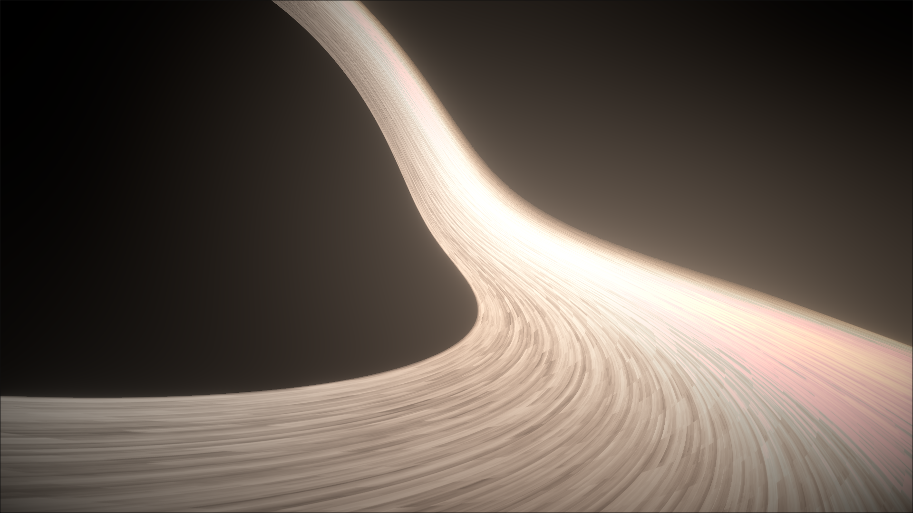
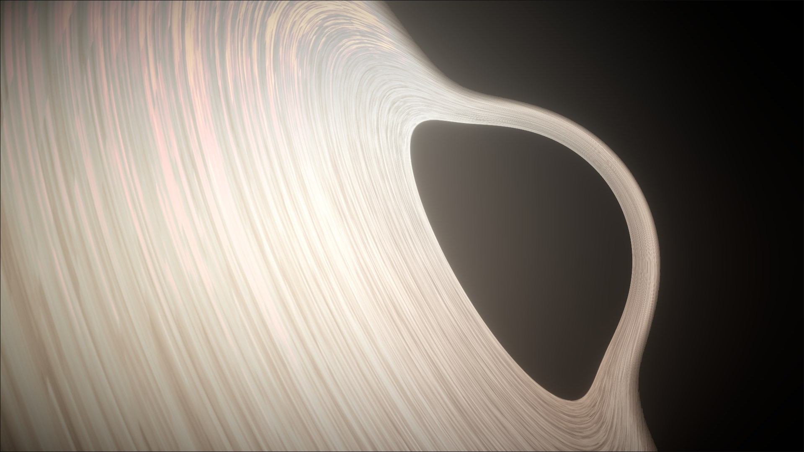
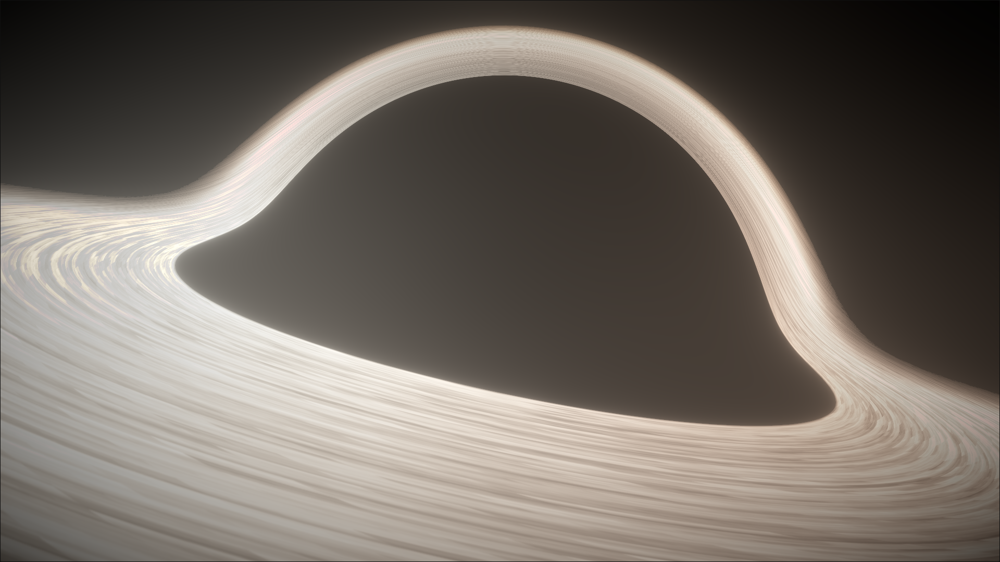
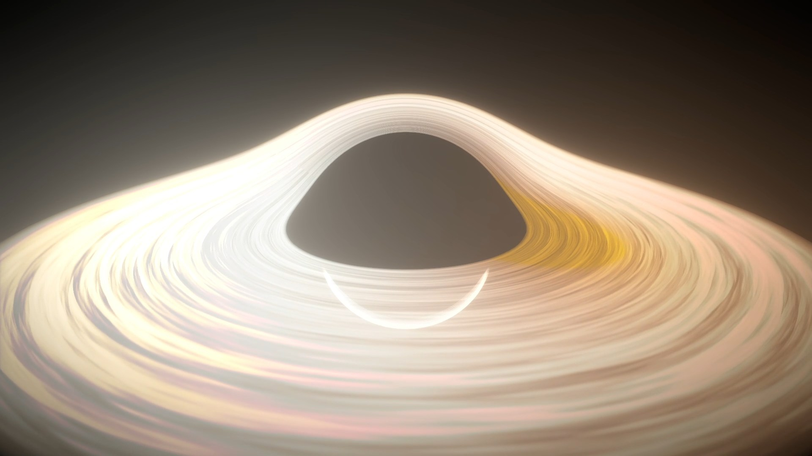
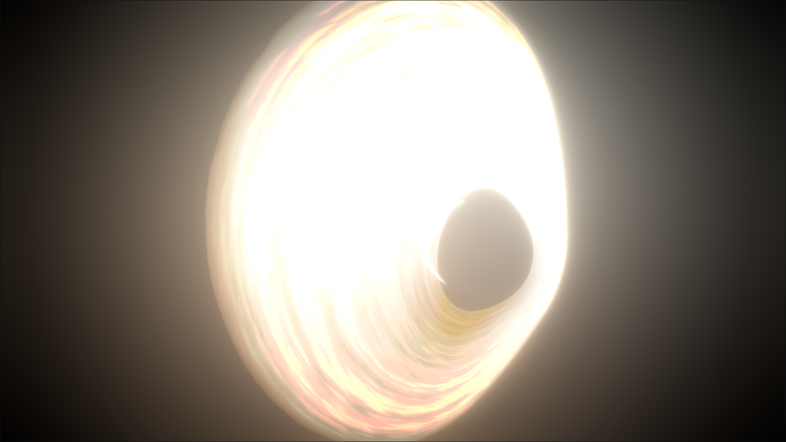
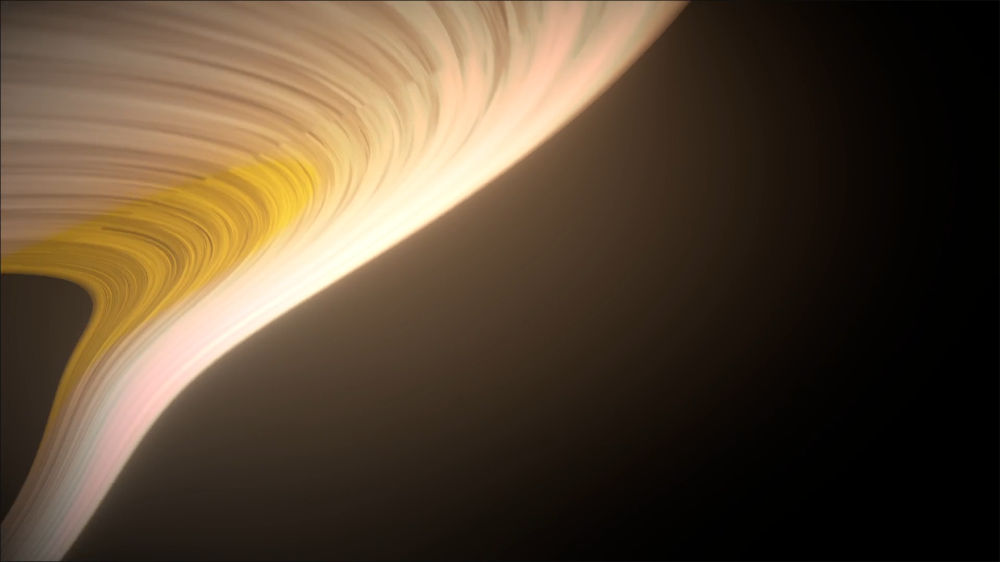
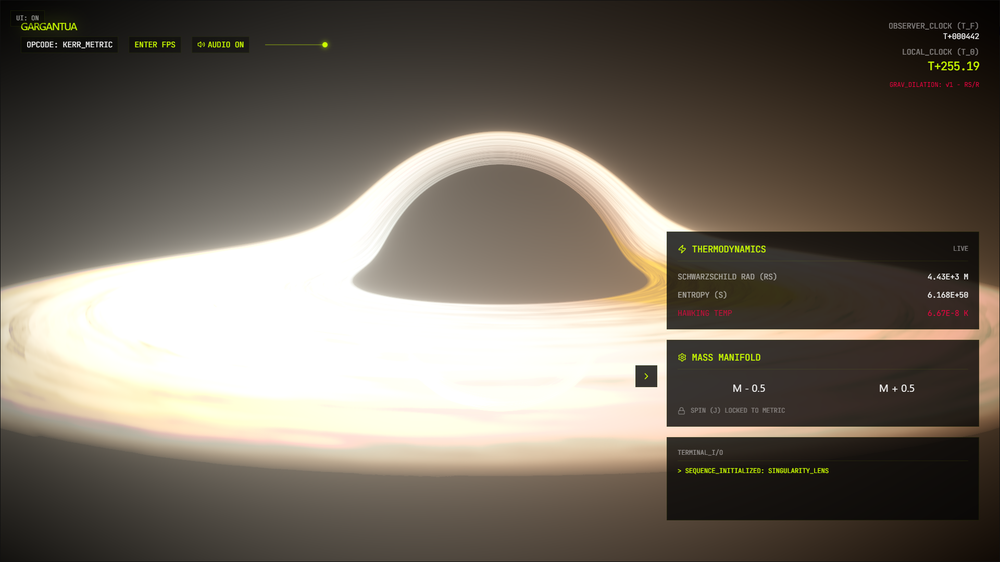

# Gargantua



A cinematic black hole simulation built with React, React Three Fiber, and custom GLSL raymarching.

The scene renders a stylized Gargantua-like singularity with:

- Relativistic lensing-inspired ray bending
- Procedural accretion disk shading
- Post-processing bloom and vignette
- Dynamic hybrid audio (procedural synthesis + layered mp3 beds)
- Telemetry HUD with pseudo-physics readouts
- Pointer-lock FPS exploration mode

## Tech Stack

- React 19
- Vite 8
- Three.js
- @react-three/fiber
- @react-three/drei
- @react-three/postprocessing
- framer-motion
- Tailwind CSS 4

## Getting Started

1. Install dependencies:

```bash
npm install
```

2. Start the dev server:

```bash
npm run dev
```

3. Open the local Vite URL shown in the terminal.

## Scripts

- `npm run dev` - Start development server
- `npm run build` - Create production build
- `npm run preview` - Preview production build locally
- `npm run lint` - Run ESLint

## Screenshots and Demos

### Gallery














## Controls

### UI Controls

- `M - 0.5` / `M + 0.5`: decrease or increase mass parameter
- `ENTER FPS`: switch to first-person mode
- `EXIT FPS [ESC]`: leave first-person mode
- `AUDIO ON / AUDIO MUTED`: toggle black hole audio bed with smooth gain ramp

### FPS Navigation

- `W` / `S`: forward and backward thrust
- `A` / `D`: strafe left and right
- `Shift` / `Control`: move up and down
- `Mouse`: look around
- `Hold R` + move mouse horizontally: roll camera
- `ESC`: release pointer lock and disable FPS mode

## Mathematics and Rendering Model

This project is artistically tuned, but it is grounded in core black hole equations and then adapted into real-time shader techniques.

### 1) Schwarzschild Geometry

For a non-rotating black hole, spacetime is described by the Schwarzschild metric:

$$
ds^2 = -\left(1 - \frac{2GM}{c^2r}\right)c^2dt^2
+ \left(1 - \frac{2GM}{c^2r}\right)^{-1}dr^2
+ r^2(d\theta^2 + \sin^2\theta\, d\phi^2)
$$

The event horizon radius is:

$$
R_s = \frac{2GM}{c^2}
$$

In this simulation, the shader uses a normalized form with $c=1$ and $G=1$ for stability and speed, so it computes an effective radius as:

$$
R_s \approx 2GM
$$

### 2) Gravitational Time Dilation

Time dilation for a static observer at radius $r$ is:

$$
t_0 = t_f \sqrt{1 - \frac{R_s}{r}}
$$

The telemetry HUD uses this relation to produce the local-vs-distant clock readout in real time.

### 3) Black Hole Thermodynamics

Hawking temperature:

$$
T_H = \frac{\hbar c^3}{8\pi G M k_B}
$$

Bekenstein-Hawking entropy:

$$
S = \frac{k_B A}{4\ell_P^2}
$$

The HUD displays stylized, pseudo-scaled versions of these quantities to communicate behavior trends (for example, $T_H \propto 1/M$), not exact SI-accurate astrophysical outputs.

### 4) Kerr Inspiration (Rotation)

Real black holes are usually rotating and are described by the Kerr metric:

$$
ds^2 = -\frac{\Delta}{\rho^2}(dt - a\sin^2\theta\,d\phi)^2
+ \frac{\rho^2}{\Delta}dr^2
+ \rho^2 d\theta^2
+ \frac{\sin^2\theta}{\rho^2}\left[(r^2+a^2)d\phi - a\,dt\right]^2
$$

where $a = J/M$. This project currently focuses on a Schwarzschild-like core with Kerr-inspired UI/world flavor and controls.

### 5) Real-Time Techniques Used Here

- Raymarching through a large enclosing volume to integrate color along bent light paths.
- Relativistic lensing-inspired ray bending via an inverse-cube directional pull near the gravity well.
- Event horizon capture condition: if marched radius falls below $R_s$, the ray is absorbed.
- Procedural accretion disk with fractal Brownian motion (FBM) noise in polar coordinates.
- Keplerian-style disk motion approximation using $v \propto 1/\sqrt{r}$ for animated swirl.
- Doppler-like beaming and color shift using the sign/magnitude of $\mathbf{v}\cdot\mathbf{\hat r}$ style directional terms.
- Adaptive step size during raymarching: smaller near the horizon/disk, larger in empty space.
- Filmic output shaping with Reinhard tone mapping and gamma correction.
- Postprocessing pass stack: Bloom + Vignette for cinematic glare/falloff.
- Diegetic telemetry overlays with pseudo-physics (Schwarzschild radius, entropy, Hawking-like temperature).

### 6) FPS Orbital Dynamics Approximation

In FPS mode, camera motion blends thrust + inertia + a simplified gravity term:

$$
\vec a_g \propto \frac{M}{r^2}\,\hat r_{toward\ origin}
$$

This is not a full geodesic solver; it is a gameplay-focused approximation for controllable "fall toward singularity" behavior.

### 7) Dynamic 3D Audio System (Non-Static, Generated)

Audio is not a fixed background loop. The soundscape is generated and modulated in real time from simulation state and camera movement.

Core ideas:

- Procedural synth bed is generated with Web Audio oscillators, noise sources, modulation LFOs, filtering, and distortion.
- Reactive audio parameters are driven every frame by runtime values like mass, spin, FPS state, and camera distance from origin.
- Distance-driven spectral motion uses a shared cutoff function so timbre opens up near the black hole and darkens farther away.
- Event one-shots are synthesized at runtime (mass-change clicks, horizon crossing pulses, chaotic bursts), so events sound context-sensitive instead of pre-baked.
- Hybrid layering combines generated synthesis with mp3 layers:
  - `blackhole.mp3` passes through distance-dependent low-pass filtering.
  - `ambient.mp3` remains full-band (no cutoff) as a stable environmental bed.
- Stereo movement and dynamics are continuously shaped (panning drift + compression + drive) to keep the mix alive and unstable.

In short: this is a procedural-reactive audio system, not a static soundtrack.

### Audio Signal Flow

```mermaid
flowchart LR
	A[Simulation State\nmass, spin, fps, camera distance] --> B[BlackholeAudioEngine\nprocedural synth + modulation]
	A --> C[Distance->Cutoff Mapper]

	B --> D[Pre Drive]
	D --> E[WaveShaper Distortion]
	E --> F[Post Lowpass]
	F --> G[Stereo Panner]

	H[blackhole.mp3] --> I[Lowpass Filter\n(distance-reactive)]
	J[ambient.mp3] --> K[Ambient Gain\n(no cutoff)]

	C --> F
	C --> I

	I --> L[Layer Gain]
	K --> M[Layer Gain]
	G --> N[Master Gain]
	L --> N
	M --> N

	N --> O[Dynamics Compressor]
	O --> P[Audio Output]

	Q[Events\nmass-click, horizon pulse, chaos burst] --> B
```

This flow is updated in real time, so the perceived tone, motion, and intensity continuously evolve with observer movement and black hole parameters.

### 8) Physical Accuracy vs Artistic Approximation

| Area                    | Physically Inspired Basis                                        | Approximation in This Project                                              | Why This Tradeoff Exists                                              |
| ----------------------- | ---------------------------------------------------------------- | -------------------------------------------------------------------------- | --------------------------------------------------------------------- |
| Spacetime model         | Schwarzschild metric and event horizon concept                   | Normalized units and shader-friendly radius checks                         | Keeps equations intuitive while preserving stable frame time          |
| Light bending           | GR lensing intuition near compact mass                           | Inverse-cube directional pull instead of full null geodesic integration    | Produces strong photon-ring-like visuals in real time                 |
| Accretion disk dynamics | Keplerian orbital behavior and relativistic beaming idea         | FBM noise disk, stylized temperature palette, heuristic Doppler multiplier | Better art direction control and lower GPU cost                       |
| Thermodynamics readouts | Hawking temperature and Bekenstein-Hawking entropy relationships | Pseudo-scaled HUD values for trend communication                           | Readable telemetry without extreme astrophysical magnitudes           |
| Time dilation           | $t_0 = t_f \sqrt{1 - R_s/r}$                                     | UI clock demonstration at fixed sample radius                              | Clear educational feedback without full observer worldline simulation |
| Camera/gravity motion   | Newtonian-style inverse-square pull toward mass center           | Gameplay-tuned acceleration, damping, and thrust                           | Makes FPS exploration responsive and fun                              |
| Rotation physics        | Kerr metric and frame-dragging concepts                          | Kerr-themed framing and controls; no full Kerr geodesic solver             | Avoids major complexity while keeping thematic fidelity               |

If you want stricter physical realism, the next upgrade path is geodesic integration in curved spacetime with a stronger physically based emissive/absorption disk model.

## Project Structure

```text
src/
	App.jsx                  # Scene setup, postprocessing, mode toggles
	audio/
		blackholeAudioEngine.js # Procedural synth engine + runtime modulation
		audioMatrix.json        # Saved audio tuning defaults
	components/
		Blackhole.jsx          # GLSL black hole + accretion disk shader
		BlackholeAudioSystem.jsx # Audio orchestration + mp3 layering
		FPSCamera.jsx          # Pointer-lock camera controls + gravity
		Telemetry.jsx          # Noisia-style HUD and control panel
		audio_controls.jsx     # Audio matrix tuning panel (currently hidden)
```

## Notes

- The simulation is artistically tuned and not intended as a physically accurate GR renderer.
- Performance depends heavily on GPU capability due to the raymarching shader.
